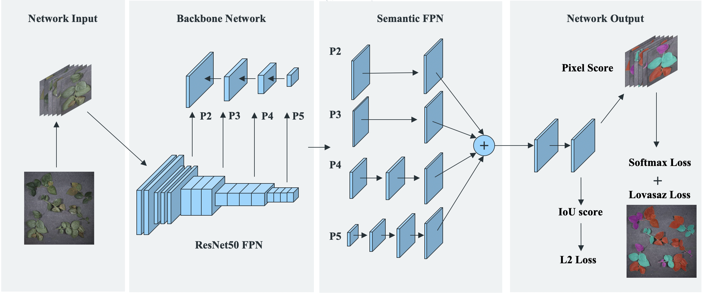

# Introduction
Implementation of **Quality-Aware Network for Plant Parsing**

In this repository, we release the QANet code in Pytorch.

- QANet architecture:
<p align="center"></p>


## Installation

- 1 x RTX GPU
- pytorch1.6
- python3.6.8

Install QANet following [INSTALL.md].


## Data Prepare

Please follow [DATA_PREPARE.md] to download training and evaluating data.


## Results and Models

**QANet On Plant parsing dataset**

|  Backbone  | DOWNLOAD |
|:----------:|:--------:|
|  ResNet50  | [GoogleDrive](https://drive.google.com/drive/folders/1DEqkkTKCbAvLXhJeoy2NC5CYZlr41Wak?usp=sharing) |        

please put the pretrained weights in `QANet/weights`


## Training

To train a model with 1 GPUs run:
```
python tools/train_net_all.py --cfg cfgs/CIHP/QANet/QANet_R-50c_512x384_1x.yaml --gpu_id 0
```

## Evaluation

### single-gpu evaluation,
```
python tools/test_net_all.py --cfg ckpts/CIHP/QANet/QANet_R-50c_512x384_1x/QANet_R-50c_512x384_1x.yaml --gpu_id 0
```

## License
QANet is released under the [MIT license](https://github.com/soeaver/QANet/blob/master/LICENSE).
